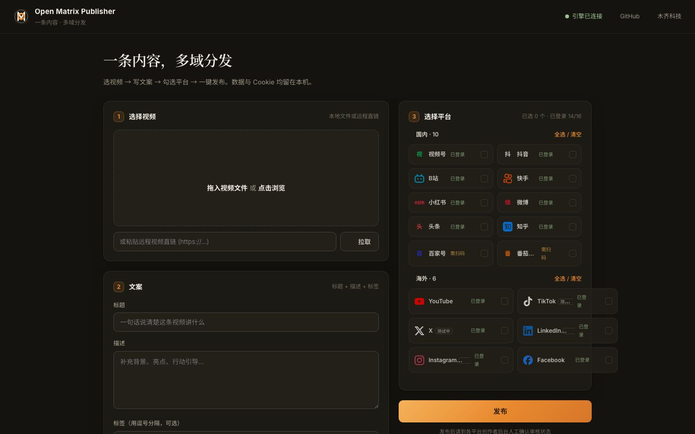

<p align="center">
  
</p>

# 🌐 Open Matrix Publisher (全域矩阵)
### Open-Source, Local-First Multi-Domain Distribution Tool for Global Commerce & Content Creators

> **Slogan：一条内容，多域分发 · One Content, Multi-Domain Distribution**  
> 专为传统国际贸易 B2B 工厂、跨境电商 DTC 品牌与全球化创作者打造的 AI 原生全域社媒分发与营销中枢。  
> An AI-Native multi-domain distribution hub empowering B2B factories, cross-border DTC brands, and global content creators.

---

> **🙏 如果这个工具帮你省了时间，赞助我们 ¥50 帮我们买服务器、测更多平台！**
> 
> 你的赞助 = 我能多测 3 个国际平台 = 你未来能多发 3 个平台。
> 
> | 微信赞赏 | GitHub Sponsors | 爱发电 |
> | :---: | :---: | :---: |
> |  | [](https://github.com/sponsors/Martin-MQtech) | [](https://afdian.com/a/martin-mqtech) |
> 
> *所有赞助资金公示于 [SPONSORS.md](SPONSORS.md)。100% 用于：服务器费 / API 测试账号 / 国际化翻译。*

---

[](https://github.com/Martin-MQtech/open-matrix-publisher)
[](LICENSE)
[](https://python.org)
[](https://modelcontextprotocol.io)

**🌐 Official Website ( Landing Page · Docs · Downloads )**: [https://martin-mqtech.github.io/open-matrix-publisher/](https://martin-mqtech.github.io/open-matrix-publisher/)  
**💻 Local Studio App UI ( Run on Desktop Console )**:

<p align="center">
  
</p>

**Core Workflow Demo (15 Seconds)**: Select Video → Write Copy → Check Platforms → One-Click Multi-Publish.

<p align="center">
  
</p>

---

## 🚀 English Quick Overview (Summary for Global Users)

**Open Matrix Publisher** is an open-source, desktop-first, privacy-respecting content distribution matrix tool that automates content publishing across domestic Chinese and top international social networks.

### 🌟 Key Highlights:
1. **20 Platform Matrix (国内 10 · 国际 10)**:
   - **Domestic (🇨🇳)**: WeChat Channels (视频号), Douyin (抖音), Bilibili (B站), Kuaishou (快手), RED (小红书), Weibo (微博), Toutiao (今日头条), Zhihu (知乎), Baijiahao (百家号), Haokan (好看视频).
   - **Global (🌏)**: YouTube / Shorts, TikTok, Instagram Reels, Facebook Video, X (Twitter), LinkedIn, Dev.to, WordPress, Telegram, Pinterest, and expanding candidates (Google Blogger, Substack, Meta Threads, Rumble).
2. **100% Local & Privacy-First**:
   - All cookies, tokens, and videos stay strictly on your local machine. No cloud tracking, zero data leaks.
3. **AI-Native MCP Integration (DeepSeek / Claude / Cursor Ready)**:
   - Includes a standard Model Context Protocol (MCP) server (`mcp_server.py`). Autonomous AI Agents can directly discover accounts, check login statuses, and trigger one-click batch publishing.
4. **Zero API Subscription Fees**:
   - Uses Patchright CDP stealth automation & free web AI connectors (Doubao / Kimi) for zero-cost爆款 copy generation without requiring expensive API keys.

---

## 🎯 核心定位与服务人群 (Target Personas & Use Cases)

Open Matrix Publisher 旨在打破国内外割裂的自媒体营销现状，为以下核心人群提供**零成本、高并发、中英双语、本地安全**的一站式全网营销中枢：

| 适用对象 Target Persona | 核心痛点 Pain Points | Open Matrix Publisher 赋能 Solutions |
| :--- | :--- | :--- |
| **🏭 传统国际贸易 B2B 工厂**<br>*(Traditional B2B Exporters & Factories)* | 拥有优质制造与专利，缺乏海外社媒获客渠道<br>*(Strong manufacturing, lacking overseas leads)* | 一键将工厂实拍、生产线与质检视频发至 LinkedIn、YouTube、X、视频号、知乎，外贸询盘直达。<br>*(One-click dispatch product & factory videos to LinkedIn, YouTube, X, WeChat & Zhihu for direct leads)* |
| **🛍️ 跨境电商与出海 DTC 品牌**<br>*(Cross-Border Sellers & Global DTC Brands)* | 多平台社媒种草成本高，海外 SaaS 昂贵且不支持国内平台<br>*(High social marketing cost; SaaS tools like Buffer are expensive & lack Chinese platforms)* | 一键同步短视频至 TikTok、Instagram Reels、Facebook Video、抖音、小红书，全网裂变种草。<br>*(Batch publish videos to TikTok, IG Reels, FB, Douyin & RED for viral brand exposure)* |
| **🌍 出海项目与全球化创作者**<br>*(Global Projects & International Creators)* | 中英双语内容流转繁琐，跨国平台风控与登录态管理困难<br>*(Complex bilingual workflow; tough cookie/login persistence across global sites)* | 免 API 费 AI 网页连通器提取中英爆款标题，Patchright 真实浏览器指纹隔离，安全防封静默分发。<br>*(Free AI copy parser, Patchright stealth CDP fingerprint isolation, silent zero-leak distribution)* |

---

## 🌐 平台分发矩阵 (Platform Matrix)

> 登录方式一站式：控制台平台卡片点「扫码登录/刷新」→ 弹出登录窗口 → Cookie 自动落盘本地 `cookies/`，之后全部静默复用，无需重复登录。

### 🇨🇳 国内阵列 (10 Domestic Chinese Platforms)

| 平台 Platform | 引擎 Engine | 登录方式 Login | 验证状态 Status |
| :--- | :--- | :--- | :--- |
| **微信视频号** (WeChat Channels) | SAU 引擎 | 微信扫码 (Scan QR) | ✅ 已接入 (Ready) |
| **抖音** (Douyin) | SAU 引擎 | 扫码 (Scan QR) | ✅ 已接入 (Ready) |
| **B站** (Bilibili) | SAU 引擎 | 扫码 (biliup) | ✅ 已接入 (Ready) |
| **快手** (Kuaishou) | SAU 引擎 | 扫码 (Scan QR) | ✅ 已接入 (Ready) |
| **小红书** (RED) | SAU 引擎 | 扫码 (Scan QR) | ✅ 已接入 (Ready) |
| **微博** (Weibo) | 自定义适配器 | 账号密码 / 扫码 | ✅ 已接入 (Ready) |
| **今日头条** (Toutiao) | 自定义适配器 | 账号密码 / 扫码 | ✅ 已接入 (Ready) |
| **知乎** (Zhihu) | 自定义适配器 | 扫码 (Scan QR) | ✅ 已接入 (Ready) |
| **百家号** (Baijiahao) | 自定义适配器 | 扫码 (Scan QR) | ✅ 已接入 (Ready) |
| **好看视频** (Haokan) | 自定义适配器 | 扫码 (Scan QR) | ✅ 已接入 (Ready) |

### 🌏 海外与扩展阵列 (10 Global + Extended Candidate Platforms)

| 平台 Platform | 引擎 Engine | 登录方式 Login | 验证状态 Status |
| :--- | :--- | :--- | :--- |
| **YouTube / Shorts** | SAU 引擎 | Google 账号 | ✅ 已接入 (Verified) |
| **Facebook Video** | 自定义适配器 | 账号密码 / Cookie | ✅ 实测发布成功 (Verified) |
| **TikTok** | Patchright 适配器 | 扫码 / Google / Apple | ✅ 实测发布成功 (Verified) |
| **Instagram Reels** | instagrapi 移动 API | 账号密码 / SessionID | ✅ 实测发布成功 (Verified) |
| **X (Twitter)** | 自定义适配器 | 账号密码 / Google | ✅ 实测发布成功 (Verified) |
| **Dev.to** | 免费官方 API | API Key（控制台配置） | ✅ 免费 API 已接入，实测发布成功 |
| **WordPress** | 免费官方 API | 应用密码（控制台配置） | ✅ 免费 API 已接入 · 支持真视频上传嵌入 (Video Embed, Verified) |
| **Telegram** | 免费 Bot API | bot_token + chat_id（控制台配置） | ✅ 免费 API 已接入 (Free API, Verified) |
| **Pinterest** | 免费官方 API | access_token + board_id（控制台配置） | ✅ 免费 API 已接入 (Free API, Added — 视频 Pin 需 Standard access 审核) |
| **LinkedIn** | —（待官方 API） | — | ⛔ 暂不支持 (Web 反自动化拦截，待官方 Marketing API) |
| **Google Blogger** | Patchright / API | Google 账号 | 🌟 候选扩充 (SEO Candidate) |
| **Substack** | Patchright / Session | 邮箱凭证 | 🌟 候选扩充 (Newsletter Candidate) |
| **Meta Threads** | IG Session 复用 | IG 凭证复用 | 🌟 候选扩充 (Threads Candidate) |
| **Rumble** | Patchright / Session | 账号密码 | 🌟 候选扩充 (Independent Candidate) |

---

## 🤖 全球主流 AI 智能体编排生态 (Bilingual AI Agent Ecosystem)

本项目原生深度适配全球主流自主智能体架构 (AI Agents) 与 MCP 协议：

- **DeepSeek Harness (MCP / CLI)**：可通过 JSON-RPC Stdio 协议直接指挥全网 20 大平台分发（参见 [`docs/DEEPSEEK_CHEATSHEET.md`](docs/DEEPSEEK_CHEATSHEET.md)）。
- **Google Antigravity (AGY Jump)**：原生 Skill 规范支持（`skills/open-matrix-publisher/SKILL.md`），多 Agent 协同调度。
- **Claude Code & Cursor**：内置标准 MCP Server（`mcp_server.py`），对话中一句话触发全网分发。
- **Nous Hermes & Zed**：Zed Context Servers 原生 MCP 扩展与 CLI 管道极速编排。
- **Dify / n8n / 扣子 Coze**：开放标准 REST Webhook（`POST /api/publish`）。

---

## 🖥️ 快速开始与使用指南 (Quick Start Guide)

### 1. 界面预览 (Static Preview)
👉 浏览器在线预览落地页：[https://martin-mqtech.github.io/open-matrix-publisher/](https://martin-mqtech.github.io/open-matrix-publisher/)  
> Note: The web preview is a static introduction. **Actual multi-platform publishing runs locally on your PC/Mac**; videos and cookies never leave your machine.

### 2. 本地安装与运行 (Local Installation)

**Prerequisites**: macOS / Windows / Linux · Python 3.10+ · git.

> **上传引擎依赖 (Upload Engine Dependency)**：本工具的分发引擎基于开源项目
> [social-auto-upload (SAU)](https://github.com/dreammis/social-auto-upload)（浏览器自动化上传）。
> `start_ui.sh` 会自动检测本机 SAU 安装；未安装时会在终端引导一键安装
> （clone + 独立 venv + 依赖 + Chromium，约需数分钟与数百 MB 磁盘空间）。
> 已装在自定义位置时，启动前设置 `SAU_ROOT=/path/to/social-auto-upload` 即可。

**Step 1 · Clone Repository (获取代码)**
```bash
git clone https://github.com/Martin-MQtech/open-matrix-publisher.git
cd open-matrix-publisher
```

**Step 2 · Launch Local Console (启动控制台)**
- **macOS / Linux**:
  ```bash
  ./start_ui.sh
  # 首次运行会自动检测/引导安装 SAU 引擎，完成后自动打开 http://localhost:5001
  ```
- **Windows**:
  ```cmd
  double-click start_ui.bat
  # Or run start_ui.ps1 in PowerShell
  ```

**Step 3 · Scan QR Code Login (一键扫码授权)**
Click **"Scan Login / Refresh"** on any platform card in the console. Scan the QR code to save your session locally into `cookies/`. Future uploads run silently without logging in again.

### 3. MCP Agent Configuration (Claude Desktop / Cursor / DeepSeek)
```json
{
  "mcpServers": {
    "open-matrix-publisher": {
      "command": "python3",
      "args": ["/path/to/open-matrix-publisher/mcp_server.py"]
    }
  }
}
```

---

## 📄 开源许可证 (License)

本项目遵循 [MIT License](LICENSE) 开源协议。  
孵化自 **木齐科技 (MUQI Tech · [www.emuqi.com](https://www.emuqi.com))** AIGC×氢健康×医疗器械: 产业实践&商业观察。
